# Project Setup
1. create a [firebase](https://nabeelj.medium.com/how-to-connect-your-android-app-to-firebase-7b2ccdc98f7e) app and replace google-services.json file in both the admin and Veggies app at `VeggiesAdmin/app/` or
`Veggies/app/`(no need to change the grandle files, dependencies are already there). do not forget to add both the app i.e. admin and veggies  to the firebase.
Note: do not update any dependency because it will the code.

2. ###### Firebase configuration
   1. setup your firestore database
   2. setup your rules-only for development mode.
         ```js 
      rules_version = '2';
      service cloud.firestore {
      match /databases/{database}/documents {
         match /{document=**} {
            allow read, write: if
               request.time < timestamp.date(2022, 10, 31);
         }
      }
      }
      ```
   3. setup your firebase storage and it's rule `allow read, write: if true;`
   4. setup authentication and enable gmail, email and phone authentication 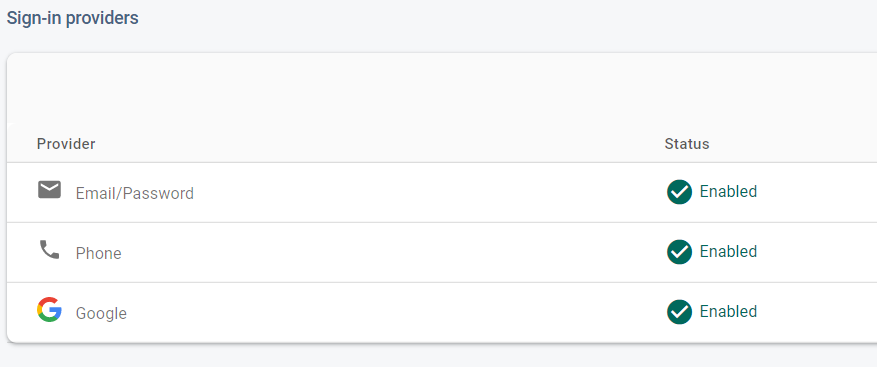
   
3. create your firebase server key for push notification
and add them below two places (search by pressing ctrl+shift+F to globally find the keywords.)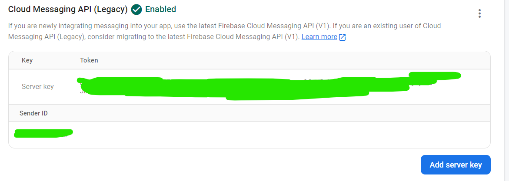
   1. `"Authorization:key=your server key"` at APIService.java in veggies app.
   2. `"Authorization:key=your server key"` at APIService.java in admin app.

4. #### Create Dummy Data
   1. before you build your project you have to upload some data according to the schema designed in the code.
   2. to upload data and product images we have to use both the storage and database. i am providing here the some 10 products data you can use and test your app. create folder inside firebase storage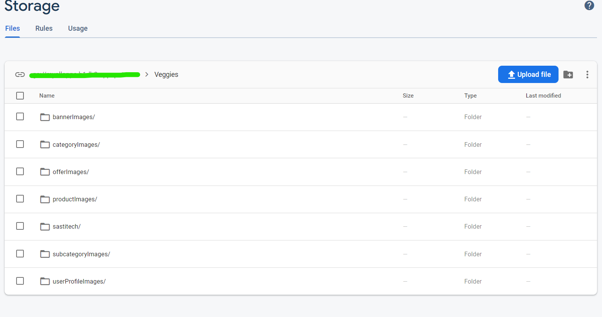
   3. first, add 10 different users into firebase manually.
   4. add admin account veggies.admin@gamil.com for the VeggiesAdmin app.
   5. 
     | Email                               | Password |
     | :---------------------------------- | :------- |
     | ncorstorphinec@networksolutions.com | password |
     | crousby3@wisc.edu                   | password |
     | jcorsar5@webnode.com                | password |
     | dwinearb@sciencedirect.com          | password |
     | bbutter7@nba.com                    | password |
     | rsiccombe2@plala.or.jp              | password |
     | fshelborne1@nydailynews.com         | password |
     | hchellingworthf@posterous.com       | password |
     | thatchella@unc.edu                  | password |
     | cbovaird0@paypal.com                | password |
     | sdamarellh@sakura.ne.jp             | password |

   6. once you added these emails, you will get to see a unique ID .paste these unique ids at the key and userId(this has to be same otherwise the code will break)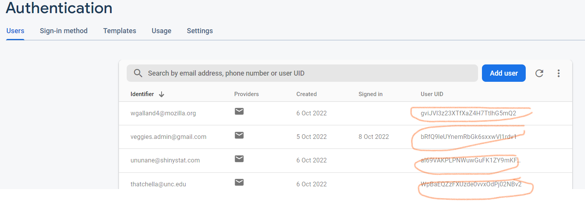
   7. after this, copy and paste these unique ids in the `sample-firebase.json` file at `user` collection. because when we import this data it will create the documents with the same id inside `user` collection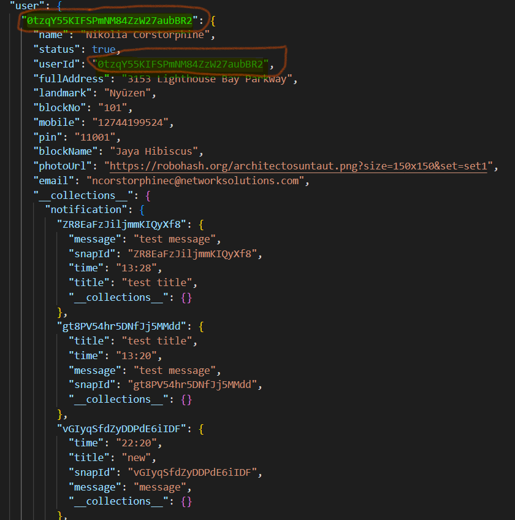.<br/> now your user collection is done when you replace for 11 users.
   8. let's now change the `productList`-for that you have to upload 10 product images in the firebase storage and take their URL and Place them at `imageUrl` one by one.the path will be same as `Veggies/productImages`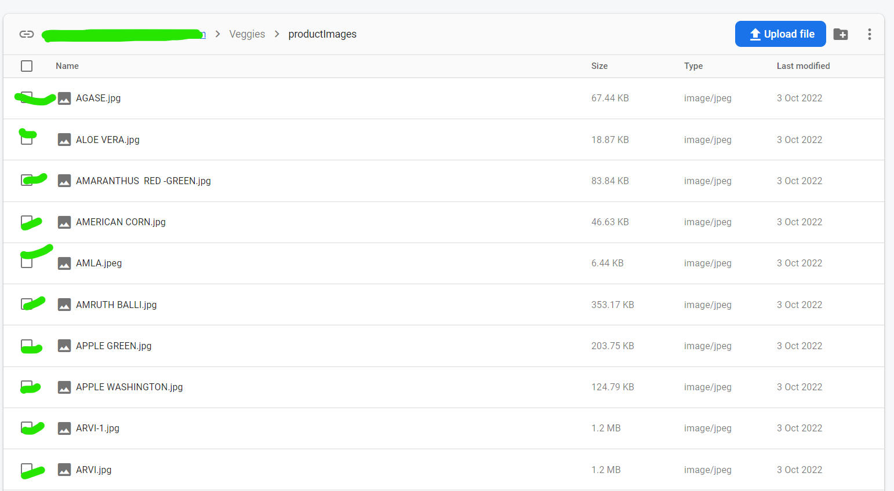 <br/> click on the image and you will get a public URL that you can paste into `productList` collection inside `imageUrl` <br/>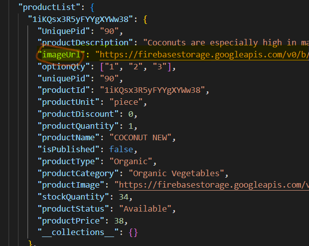<br/>do this for all 10 products and make sure the name and description of the product match with the image Name otherwise it will create discrepancies in the image and the product displayed in the Veggies app.for that, there is folder with productImages that you can use.
   9. do the same with the `DemoProducts` collection in `sample-firebase.json` file-upload image and paste url you can also change the name and description , can also limit the product by deleting their json objects.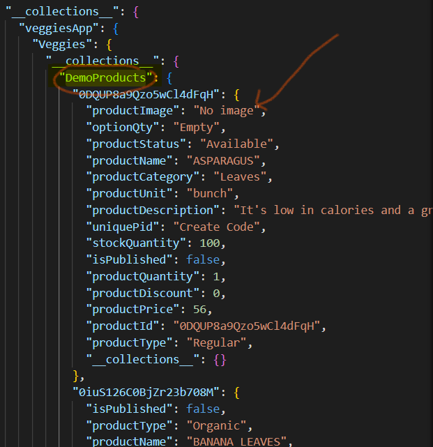
   10. do the same with the `Offer`[offer](assets/offer) and `bannerOffer`. for `bannerOffer` there is no image but you can change the text from the admin app that i will show you later.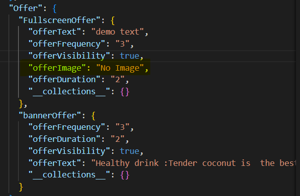
   11. do the same with the `allProductImages` and change their `imageUrl` and `imageName` according to the picture that you will upload.this collection will hold all the url of all the images that will uploaded to the firebase storage from the admin app.<br/>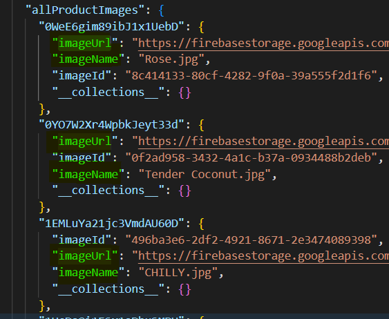
   12. do the same with the `banner` collection ,upload images from [folder](assets/banner) change their `bannerImage` .
   13. do the same with the `category` collection -upload images from [folder](assets/category) and change their `categoryImage` fields.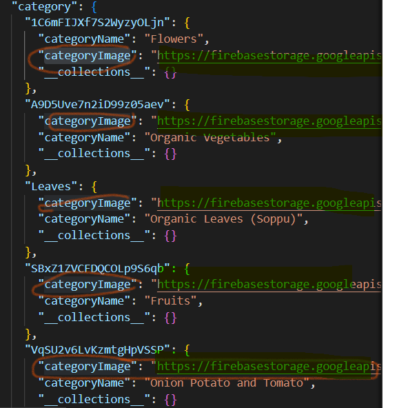
   14. do the same with the `democategory` collection -upload images from [folder](assets/democategory) and change their `categoryImage` fields.
   15. Finally your Collection is ready to be imported on firebase.
5. #### Import Sample-firebase.json to Firebase
   1. Generate the New private Key `project settings->service account`
   2. Open CMD and install [node-firebase-import-export](https://github.com/jloosli/node-firestore-import-export) globally . please make sure that you already have node installed(you can check by `node --version`in cmd, if you don't have it installed then you have to install node first because we will be using firebase SDK which is node-js based SDK). `npm install -g node-firestore-import-export`.
   3. Import full database.
      ```shell
      firestore-import --accountCredentials path/to/credentials/Keyfile.json --backupFile /folder/sample-firebase.json
      ```
      this will import all data to the firebase.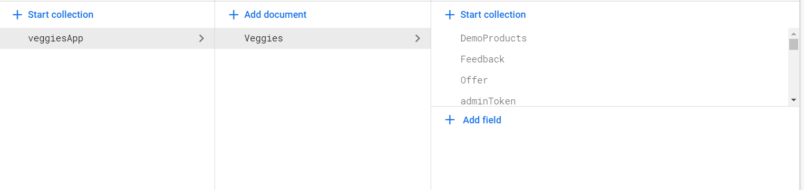
   4. follow link for more details- [import-export](Notes.md)  

6. #### Creating Firebase Indexes
   1. before you build and run the whole project we have to create some indexes on firebase for the search querries.
   2. 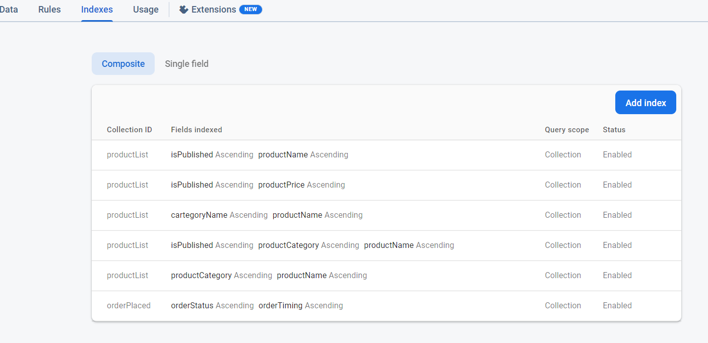

7. Now you can Run and Build your project. there are two folders Veggies and VeggiesAdmin . you can build one by one.