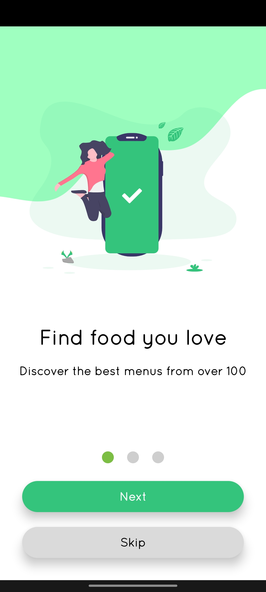

The veggie is an app created using firebase. its purpose is to serve local-street vendors in a small colony of people who want to do their business online. Whenever an order comes, the seller can send his delivery boy to deliver veggies. it is an app for vegetable sellers who are due to covid, were not able to sell their vegetables online. the seller can enlist their product through the admin app. the purpose of this app is to serve the local vendors and sellers that's why it doesn't contain any online payment gateway consequently we tried to keep its interface and functionality very simple.

**Splash Screen**
|  |  |  |  |
| :----------------------------------------- | :----------------------------------------- | :----------------------------------------- | :----------------------------------------- |

 

**Interface**
|  |  |  |  |
| :------------------------------------ | :------------------------------------- | :------------------------------------- | :------------------------------------ |

 

**Features**
|  |  |  |  |
| :------------------------------------- | :------------------------------------- | :------------------------------------- | :------------------------------------- |

 

**Amin App**
|  |  |  |  |
| :---------------------------------------- | :---------------------------------------- | :---------------------------------------- | :---------------------------------------- |

## Veggies App 
1. Features
   1. search the product
   2. order Product
   3. profile create
   4. categorised product
   5. Cancel Order
   6. Notification Confirmation
   7. Profile Image,Address,Landmark and block Name
   8. Give Feedback
   9. Contact seller via email and Phone
   10. Share App
   11. Login/ Logout is compulsary
   12. About 
   13. Privacy
   14. FAQs and support page
   
2. ## Veggies Admin App
   |  |  |
   | :------------------------------------------------ | :------------------------------------------------ |
   1. **See Orders and Filter them-**
      1. All
      2. Today's Order
      3. Pending order
      4. Rejected Order
      5. Cancelled Order
      6. Accepted Order
      7. Delivered Order
   2. **Bulk functions**
      1. Accept ,Delete All,Reject All 
      2. Export Customer Wise Data in Excel
      3. Export Order Wise Data in Excel 
   3. **Add Categories**
      |  |  |
      | :------------------------------------------ | :---------------------------------------------------- |
      1. Add new Product Categories
      2. Edit Categories-**Long Press on Each Items**
          <table>
          <tr>
          <td>

          </td>
          <td> 
          
          
          </td>
          </tr>
          </table>
      4. **Add Product**-Option qty is the Qty that you want item to be visible in product drop at Veggies app
      5. **Edit Product**-Delete the Product and Change it's Visiblility depending if you want to show this product to users or not
      6. **Cautions**: Hide all Products from User  
      7. **Add New Delivery Area**   
      8. **you can also Broadcast via titled notification with a message**   

